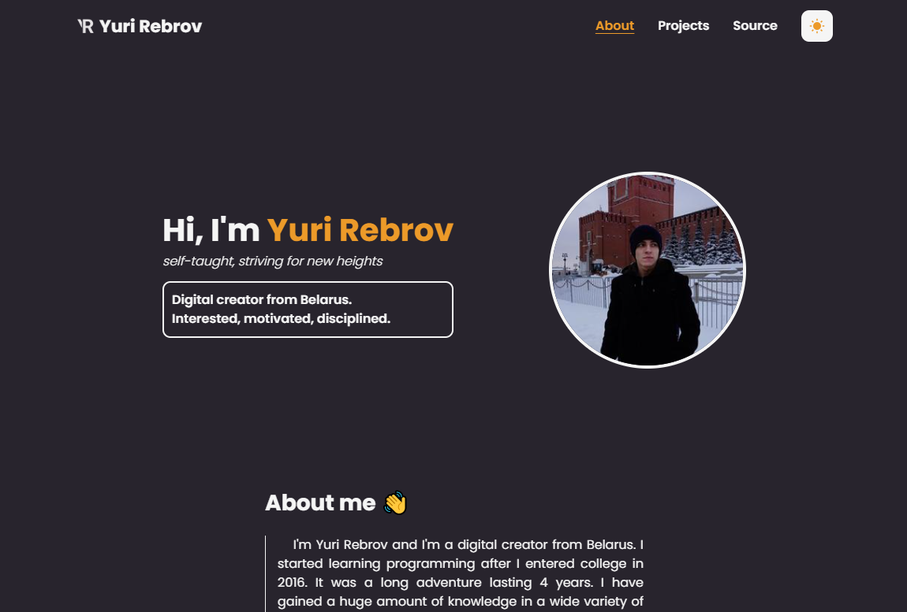

# Yuri's Homepage

[Visit my website](https://yurirebrov.netlify.app/)

## Stack
- [Next.js](https://nextjs.org/) - A React framework with hybrid static & server rendering, and route pre-fetching, etc.
- [Tailwindcss](https://tailwindcss.com/) - Tailwind CSS is an open source CSS framework.
- [Framer Motion](https://www.framer.com/motion/) - An animation library for React.
